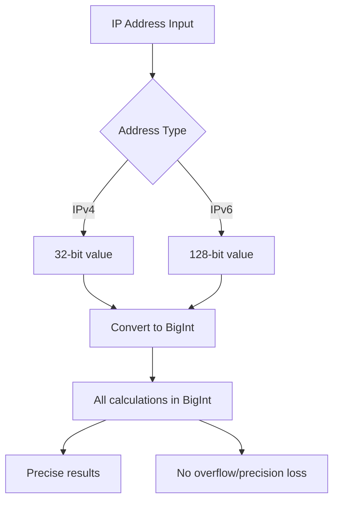
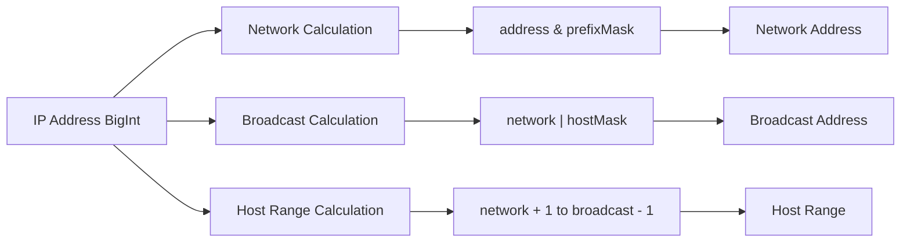
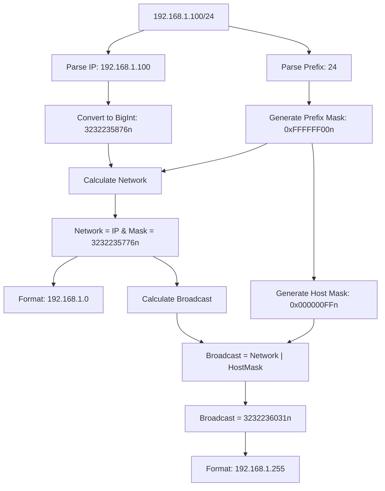
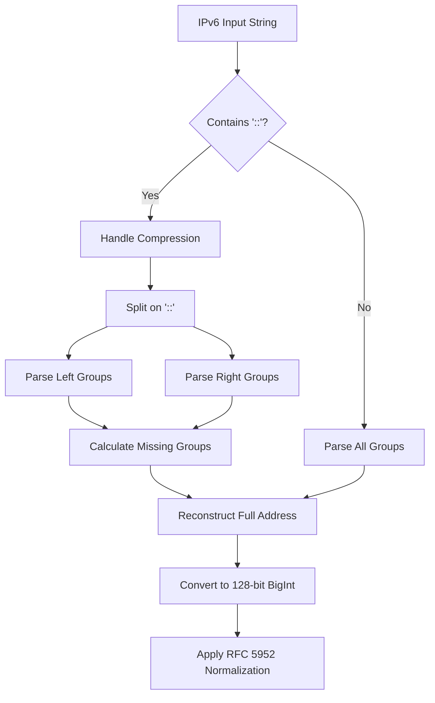
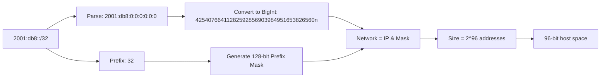
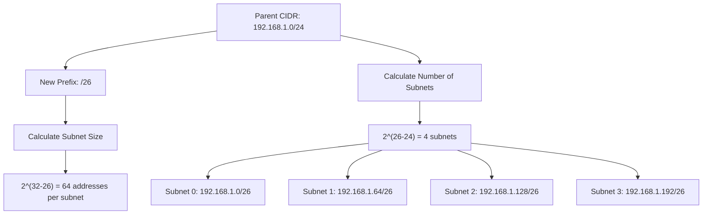
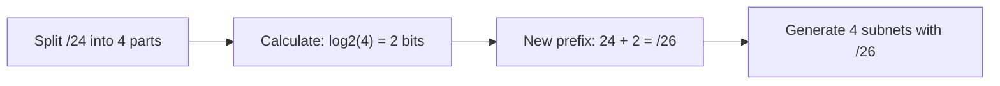
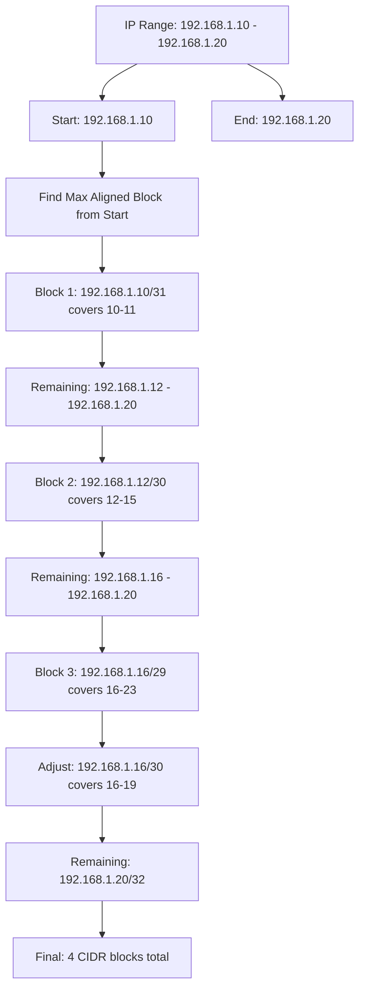
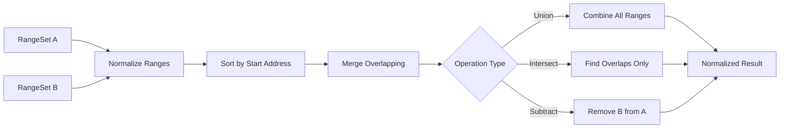
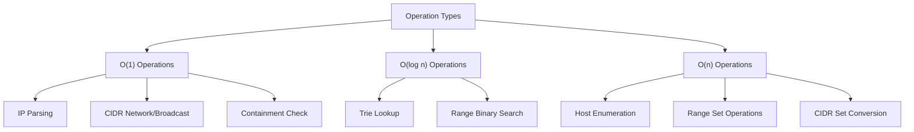

# IP Calculations in IP Toolkit

This document provides a comprehensive overview of how IP address calculations are performed in the IP Toolkit library. We'll cover the mathematical foundations, implementation strategies, and design decisions that enable precise and efficient IP operations.

## Table of Contents

- [Overview](#overview)
- [BigInt Foundation](#bigint-foundation)
- [IPv4 Calculations](#ipv4-calculations)
- [IPv6 Calculations](#ipv6-calculations)
- [CIDR Mathematics](#cidr-mathematics)
- [Range Operations](#range-operations)
- [Performance Considerations](#performance-considerations)
- [Implementation Examples](#implementation-examples)

## Overview

The IP Toolkit uses **BigInt arithmetic** for all IP address calculations to ensure precision and avoid floating-point errors, especially critical for IPv6's 128-bit address space. This approach provides mathematically correct results for operations involving large address spaces.

### Core Principles

1. **All IP addresses are stored as BigInt values**
2. **Bitwise operations use BigInt masks and shifts**
3. **No floating-point arithmetic in address calculations**
4. **Generators for memory-efficient iteration over large ranges**

## BigInt Foundation

### Why BigInt?



### Constants and Masks

The library defines core constants in `src/core/bigint.ts`:

```typescript
// IPv4 constants
export const BITS4 = 32n;
export const MAX4 = (1n << 32n) - 1n; // 4,294,967,295

// IPv6 constants
export const BITS6 = 128n;
export const MAX6 = (1n << 128n) - 1n; // 340,282,366,920,938,463,463,374,607,431,768,211,455

// Prefix mask generation
export function prefixMask(prefix: number, bits: number): bigint {
  if (!Number.isInteger(bits) || bits <= 0) {
    throw new RangeError(`bits must be a positive integer, got ${bits}`);
  }
  if (!Number.isInteger(prefix) || prefix < 0 || prefix > bits) {
    throw new RangeError(`prefix must be an integer within 0..${bits}, got ${prefix}`);
  }
  if (prefix === 0) return 0n;
  if (prefix >= bits) return (1n << BigInt(bits)) - 1n;
  return ((1n << BigInt(prefix)) - 1n) << BigInt(bits - prefix);
}

// Host mask (inverse of prefix mask)
export function hostMask(prefix: number, bits: number): bigint {
  if (!Number.isInteger(bits) || bits <= 0) {
    throw new RangeError(`bits must be a positive integer, got ${bits}`);
  }
  if (!Number.isInteger(prefix) || prefix < 0 || prefix > bits) {
    throw new RangeError(`prefix must be an integer within 0..${bits}, got ${prefix}`);
  }
  const fullMask = (1n << BigInt(bits)) - 1n;
  const prefixMaskValue = prefixMask(prefix, bits);
  return fullMask & ~prefixMaskValue;
}
```

### Mathematical Operations



## IPv4 Calculations

### Address Parsing and Conversion

IPv4 addresses are converted to 32-bit BigInt values:

```typescript
// String to BigInt conversion
function parseIPv4String(ip: string): bigint {
  const parts = ip.split('.');
  if (parts.length !== 4) throw new ParseError('Invalid IPv4 format');

  let result = 0n;
  for (let i = 0; i < 4; i++) {
    const octet = Number(parts[i]);
    if (octet < 0 || octet > 255) throw new ParseError('Invalid octet');
    result = (result << 8n) | BigInt(octet);
  }
  return result;
}

// BigInt to string conversion
function formatIPv4(value: bigint): string {
  const octets: number[] = [];
  for (let i = 3; i >= 0; i--) {
    octets.push(Number((value >> BigInt(i * 8)) & 0xffn));
  }
  return octets.join('.');
}
```

### CIDR Network Calculations



### Host Enumeration

For efficient host iteration, we use generators:

```typescript
function* hosts(network: bigint, prefix: number, includeEdges: boolean): Generator<bigint> {
  const hostBits = BITS4 - prefix;
  const hostCount = 1n << BigInt(hostBits);

  let start = network;
  let end = network + hostCount - 1n;

  // Handle edge cases for different prefix lengths
  if (!includeEdges && hostBits > 1) {
    start += 1n; // Skip network address
    end -= 1n; // Skip broadcast address
  }

  for (let host = start; host <= end; host++) {
    yield host;
  }
}
```

## IPv6 Calculations

### Address Parsing and Normalization

IPv6 parsing is more complex due to compression and various formats:



### RFC 5952 Normalization

The library implements strict RFC 5952 normalization:

```typescript
function normalizeIPv6(groups: number[]): string {
  // 1. Convert to lowercase hex
  // 2. Remove leading zeros
  // 3. Find longest run of consecutive zeros
  // 4. Compress with '::' (leftmost if tied)
  // 5. Never compress single zero group

  const formatted = groups.map((g) => g.toString(16));

  // Find longest zero run
  let maxZeroStart = -1;
  let maxZeroLength = 0;
  let currentZeroStart = -1;
  let currentZeroLength = 0;

  for (let i = 0; i < 8; i++) {
    if (groups[i] === 0) {
      if (currentZeroStart === -1) {
        currentZeroStart = i;
        currentZeroLength = 1;
      } else {
        currentZeroLength++;
      }
    } else {
      if (currentZeroLength > maxZeroLength) {
        maxZeroStart = currentZeroStart;
        maxZeroLength = currentZeroLength;
      }
      currentZeroStart = -1;
      currentZeroLength = 0;
    }
  }

  // Handle final zero run
  if (currentZeroLength > maxZeroLength) {
    maxZeroStart = currentZeroStart;
    maxZeroLength = currentZeroLength;
  }

  // Compress if run is 2 or more consecutive zeros
  if (maxZeroLength >= 2) {
    const before = formatted.slice(0, maxZeroStart);
    const after = formatted.slice(maxZeroStart + maxZeroLength);
    return before.join(':') + '::' + after.join(':');
  }

  return formatted.join(':');
}
```

### IPv6 CIDR Operations

IPv6 CIDR calculations follow the same pattern as IPv4 but with 128-bit arithmetic:



## CIDR Mathematics

### Subnetting Algorithm

Subnetting involves splitting a CIDR block into smaller, equally-sized blocks:



### Implementation

```typescript
function* subnets(
  network: bigint,
  currentPrefix: number,
  newPrefix: number,
  bits: number
): Generator<bigint> {
  if (newPrefix <= currentPrefix) {
    throw new Error('New prefix must be longer than current prefix');
  }

  const subnetBits = newPrefix - currentPrefix;
  const subnetCount = 1n << BigInt(subnetBits);
  const subnetSize = 1n << BigInt(bits - newPrefix);

  for (let i = 0n; i < subnetCount; i++) {
    yield network + i * subnetSize;
  }
}
```

### Block Splitting

For power-of-two splits, we use efficient bit shifting:



## Range Operations

### Range to CIDR Conversion

Converting IP ranges to minimal CIDR sets requires finding the largest aligned blocks:



### Algorithm

```typescript
function rangeToCIDRs(
  start: bigint,
  end: bigint,
  bits: 32 | 128
): Array<{ network: bigint; prefix: number }> {
  const cidrs: Array<{ network: bigint; prefix: number }> = [];
  let current = start;

  while (current <= end) {
    // Find the largest block that:
    // 1. Is properly aligned
    // 2. Fits within [current, end]
    // 3. May start after current (aligned boundary)

    const res = maxAlignedBlock(current, end, bits);
    if (res === null) {
      throw new Error(`No valid block found for range [${current}, ${end}]`);
    }

    cidrs.push({ network: res.block, prefix: res.prefix });

    const blockSize = 1n << BigInt(bits - res.prefix);
    current = res.block + blockSize;
  }

  return cidrs;
}

function maxAlignedBlock(
  start: bigint,
  end: bigint,
  bits: number
): { block: bigint; prefix: number } {
  // Search from largest block (prefix 0) to smallest (prefix bits)
  // to find the largest block that fits within [start, end]
  for (let prefix = 0; prefix <= bits; prefix++) {
    const blockSize = 1n << BigInt(bits - prefix);
    let network = start & prefixMask(prefix, bits);

    // If network is before start, move to next aligned boundary
    if (network < start) {
      network += blockSize;
    }

    // Check if this aligned block fits within [start, end]
    if (network + blockSize - 1n <= end) {
      return { block: network, prefix };
    }
  }

  // Fallback: single host block at start
  return { block: start, prefix: bits };
}
```

### Set Operations

Range set operations (union, intersect, subtract) use interval arithmetic:



## Performance Considerations

### Memory Efficiency

1. **Generators for Large Ranges**: Instead of materializing millions of IP addresses, we use generators:

```typescript
// Bad: Creates array of 16M+ addresses
const hosts = Array.from(cidr.hosts());

// Good: Lazy evaluation
for (const host of cidr.hosts()) {
  if (someCondition) break; // Can exit early
}
```

2. **BigInt Optimization**: While BigInt operations are slower than regular numbers, they're necessary for correctness with large IPv6 ranges.

### Algorithmic Complexity



### Edge Case Handling

Special attention is paid to boundary conditions:

1. **IPv4 /31 and /32 Networks**: Point-to-point and host routes
2. **IPv6 /127 and /128 Networks**: Similar handling for IPv6
3. **Maximum Range Sizes**: IPv6 /0 contains 2^128 addresses
4. **Alignment Requirements**: CIDR blocks must be power-of-two aligned

## Implementation Examples

### Example 1: CIDR Network Calculation

```typescript
// Input: 192.168.1.100/24
const ip = parseIPv4String('192.168.1.100'); // 3232235876n
const prefix = 24;
const prefixMaskValue = 0xffffff00n; // /24 mask (4294967040n)
const network = ip & prefixMaskValue; // 3232235776n
const networkStr = formatIPv4(network); // "192.168.1.0"
```

### Example 2: IPv6 Compression

```typescript
// Input: "2001:0db8:0000:0000:0000:0000:0000:0001"
const groups = [0x2001, 0x0db8, 0x0000, 0x0000, 0x0000, 0x0000, 0x0000, 0x0001];
// Find longest zero run: index 2-6 (length 5)
// Result: "2001:db8::1"
```

### Example 3: Range to CIDR Conversion

```typescript
// Input: 192.168.1.10 - 192.168.1.20
// Start: 3232235786n (192.168.1.10), End: 3232235796n (192.168.1.20)
// Result CIDRs:
// 1. 192.168.1.10/31 covers 192.168.1.10-11
// 2. 192.168.1.12/30 covers 192.168.1.12-15
// 3. 192.168.1.16/30 covers 192.168.1.16-19
// 4. 192.168.1.20/32 covers 192.168.1.20
```

This mathematical foundation ensures that all IP operations in the toolkit are precise, efficient, and handle edge cases correctly, providing a reliable base for network management and analysis tools.
